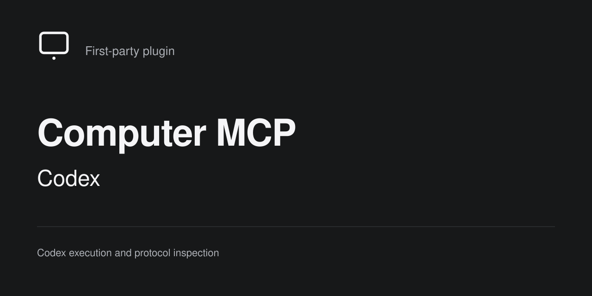

# Computer MCP — Codex

Part of the [Computer MCP](https://computer-mcp.github.io/) family.
**Let ChatGPT use your local tools.**

This independent Swift package projects Codex execution through standard MCP.
It reuses Computer MCP's existing execution implementations and swift-codex.
The host owns registration, caller grants, workspace authorization and audit.
The plugin does not link Computer MCP Core or install the vendor Codex binary.

## Current capabilities

The configured server exposes seven `codex.exec.*` tools for sessions, bounded
events, results, cancellation and retained-result release, alongside the App Server tools below.

`codex.protocol.methods.list` and `codex.protocol.methods.describe` inspect bundled,
version-specific protocol declarations. Schema presence does not prove
execution support or authorization.

App Server exposes thread/turn and Goal operations, approvals, user input,
events, runtime ownership and release, recent-thread inspection, acceptance
runs, worktree leases and operational diagnostics. Managed-worktree planning
and receipts use the adapter's database; provisioning and removal require a
connected host workspace service.

Every SDK-adopted stable request also has a `codex.app.native.*` tool with its
complete native parameter schema. For example, `codex.app.native.fs.readFile`
takes `{"params":{"path":"/absolute/path"}}`. `codex.app.methods.list` and
`describe` report stability and operation risk; `codex.app.methods.call` shares
the native runtime validation and accepts experimental methods with
`experimental: true` when the runtime enables experimental API support.
Native tools preserve request extensions, response fields and exact signed
64-bit integers. Powerful operations still require the host's corresponding
authorization. Higher-level thread, approval and worktree workflows remain
available alongside the native tools.

Thread reads return metadata by default. Use `codex.app.thread.turns.list`
and `codex.app.thread.items.list` for bounded history pages with native cursors.
Explicit full-history reads remain available through `include_turns: true`;
large histories can exceed transport, output or timeout limits. See the
[long-thread workflow](Documentation/Reference/Workflows.md#reading-long-threads).

## Build and run

On macOS, building requires macOS 14 or newer and Swift 6.2 or newer.
Run `swift build` and `swift test`. Windows x86_64 packaging uses Swift 6.2.3,
PowerShell and the pinned SQLite build described in
[Installation](Documentation/Reference/Installation.md). The Windows adapter
serves standard MCP over stdio and requires the user-installed official
Microsoft Visual C++ v14 x64 runtime. It does not provide a Windows host GUI. Launch
`.build/debug/codex-mcp-adapter` through an MCP stdio client, never as an
unbounded unattended shell command. `--help` prints usage without serving.

Without arguments the server exposes only the two protocol inspection tools.
To enable the execution providers, save the existing Codex configuration fields
as a local JSON file:

```json
{
  "enabled": true,
  "executable": "/absolute/path/to/codex",
  "app_server_enabled": false,
  "exec_enabled": true
}
```

Launch with `codex-mcp-adapter --config /absolute/path/codex.json`.
For App Server execution, set `app_server_enabled` to `true` and supply
`--state-directory /absolute/path/adapter-state`. This directory holds the
adapter's `codex.sqlite` records; it is separate from the vendor's `CODEX_HOME`
and the Computer MCP host database. Host-bound Exec also requires this directory
for shared native thread ownership. Keep it across restarts and updates.
The configuration file is bounded to 64 KiB. No executable is started for
catalog discovery. Omitted sandbox and approval settings follow native Codex
configuration, including a user-selected Full Access default. Optional adapter
settings and explicit tool parameters are native overrides, not host grants.

Computer MCP supplies the initial directory and stable authorization subject.
The host admits each invocation using its current permissions; Codex controls
its own sandbox and approvals. Explicit native directories and Full Access
selections are preserved. The initial directory is task ownership metadata,
not an operating-system sandbox. Standalone clients use their process working
directory as the initial directory.
`CODEX_HOME` remains the vendor's environment setting; do not put credentials
in arguments. Host metadata and parent session identity are not propagated to
the vendor process. Neither launch mode grants host administration.

A host that explicitly enables `hostServices` supplies the scoped MCP callback
connection for dynamic tools, managed-workspace
registration and diagnostics. See [host integration](Documentation/Reference/HostIntegration.md)
for approval ownership, recovery and availability boundaries.

See [workflows](Documentation/Reference/Workflows.md),
[package architecture](Documentation/Architecture/Package.md), and
[installation](Documentation/Reference/Installation.md).
The [documentation index](Documentation/README.md) and
[contributor guide](CONTRIBUTING.md) cover the repository's supporting material.

## Protocol inputs

The bundled inventory and adoption metadata derive from the exact swift-codex
commit in `Package.resolved`. swift-codex owns the upstream schema lock,
generation and adoption decisions. Regenerate the downstream resources after
resolving dependencies:

```sh
node Scripts/import-schema.mjs
node Scripts/import-schema.mjs --check
node --test Tests/schema-import.test.mjs
```

An optional SDK repository path supplies Git objects for the locked commit;
uncommitted files in that repository are never imported. The receipt binds the
SDK revision, upstream identity and derived resource digests. Do not edit the
resources by hand. Resource integrity is not publisher signature verification.

`codex-mcp-adapter compare-schema BASELINE_JSON_DIRECTORY CURRENT_JSON_DIRECTORY`
reports all four message directions, source digests, method and schema changes,
JSON Pointers, and required-parameter differences. It does not run Codex.

The adapter and swift-codex use the same vendor schema baseline. The installed
Codex executable can differ; declaration coverage does not establish runtime
support. Unsupported vendor methods fail explicitly.

### Offline domain-state migration

`codex-mcp-adapter migrate-state` previews a bounded, read-only source snapshot
and applies only its reviewed Codex domain records to adapter-owned persistence.
It preserves host authorization ownership and never launches a model. See
[State migration](Documentation/Reference/StateMigration.md) for snapshot,
conflict, atomicity and cutover boundaries.
